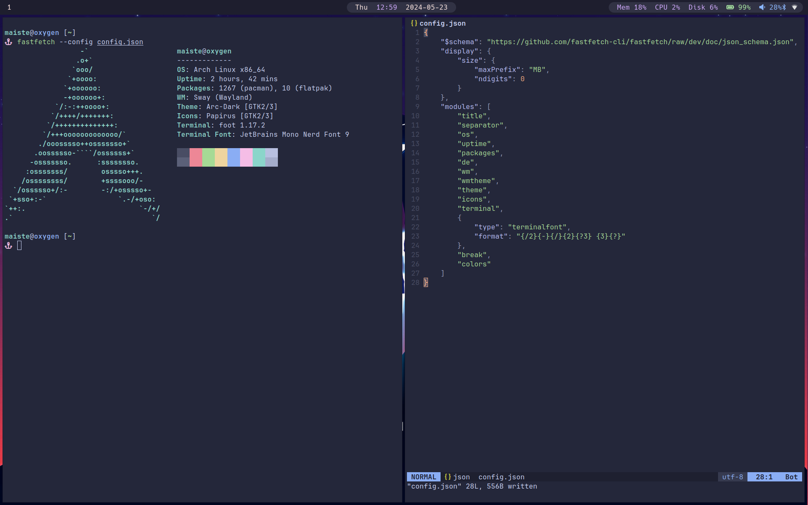

<div align="center">
    <h1>Dot dot dot</h1>
    <p>Reproductible Linux configuration</p>
</div>

## Info

This repository contains my dotfiles. I tend to change my system regularly
for working reasons so I have a few preinstalled configuration for different
distributions. Currently, I support:
 - Archlinux (_Up to date_)
 - Fedora (_Outdated_)
 - Ubuntu / PopOs (_Outdated_)

## Actual configuration

Actually, I'm working on the following configuration:
 * It works with `Arch Linux` and `nix` as a side package manager.
   Before I was using `EndervourOS` or `Fedora`.
 * `sway` is my window manager based on `Wayland`.
 * I use `tofi` as my app launcher in replacement of `Rofi`.
 * My main shell is `zsh` with `starship` as a prompt
 * `foot` as my main terminal and `slacritty`
 * `neovim` to code and take notes.
 * `Intellij` is what I used for `Java`, `Kotlin` and, `Scala`


## Desktop preview



## Use the scripts

First, this is a small description about the different [scripts](./scripts) :

| Name        | Content                                 |
| -------     | -------                                 |
| Makeinstall | Main script that launch everything      |
| Makesys     | Install the system basics like terminal |
| Makelinks   | Create all the links for the system     |
| Makenix     | Dowload extra packages from nixpkgs     |
| Makelang    | Install my favourite and used languages |


To run the entire installation you can run the following command:
```sh
 $ ./install-me [DISTRO]
```

You can choose into one of the following options for the distro:
 - arch
 - fedora
 - popos

<div align="center">
 (C) MIT Licence - Maiste
</div>

